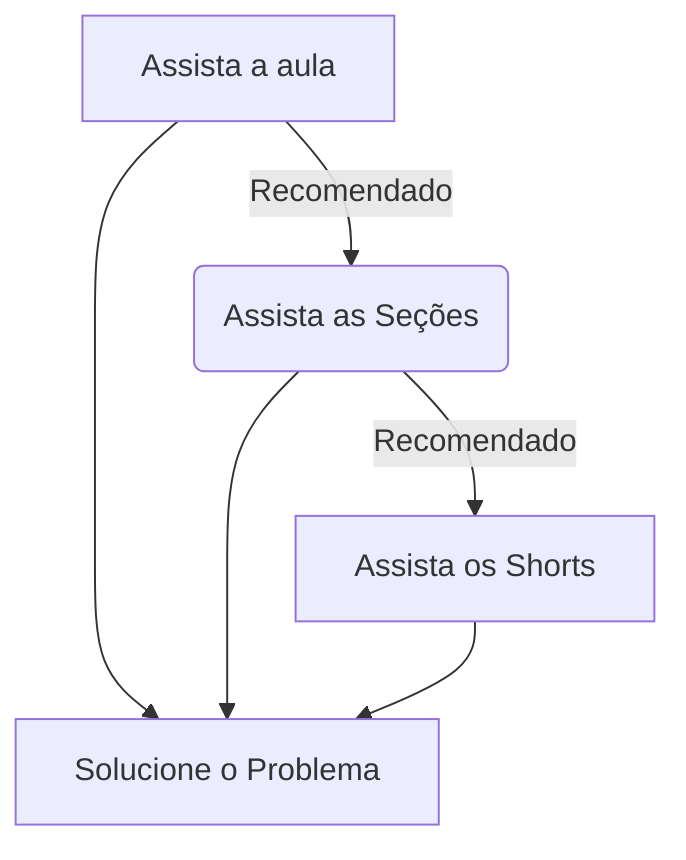

# Esse repositorio foi feito como um guia para pessoas conquistarem seu certificado **[CS50](https://cs50.harvard.edu)** de forma 100% gratuita

# Cadastro na **[EDx](https://www.edx.org/)**
1. Para conseguir seu certificado gratuitamente você tem de se cadastrar no site da **EDx**, você possui a opção de pagar pelo certificado ou conseguir gratuitamente pela plataforma de harvard.

2. Após a inscrição no site você procura pelo curso **CS50** e inscreva-se nele.

3. <mark> Não é necessário assistir as aulas pela plataforma da EDX, você pode assistir por qualquer plataforma que deseja **[CS50](https://cs50.harvard.edu)**, **[EDx](https://learning.edx.org/course/course-v1:HarvardX+CS50+X/home)** ou no **[Youtube](https://www.youtube.com/playlist?list=PLhQjrBD2T380hlTqAU8HfvVepCcjCqTg6)**. </mark>

## Dicas
1. Realize as aulas exatamente como a instituição de Havard recomenda

2. Acompanhe seu progresso em **[CS50.me](https://submit.cs50.io/users/)**

3. Versione seu código e anotações para armazenar o historico de mudanças dos seus programas e auxiliar nos seus estudos