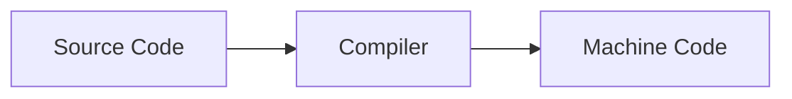
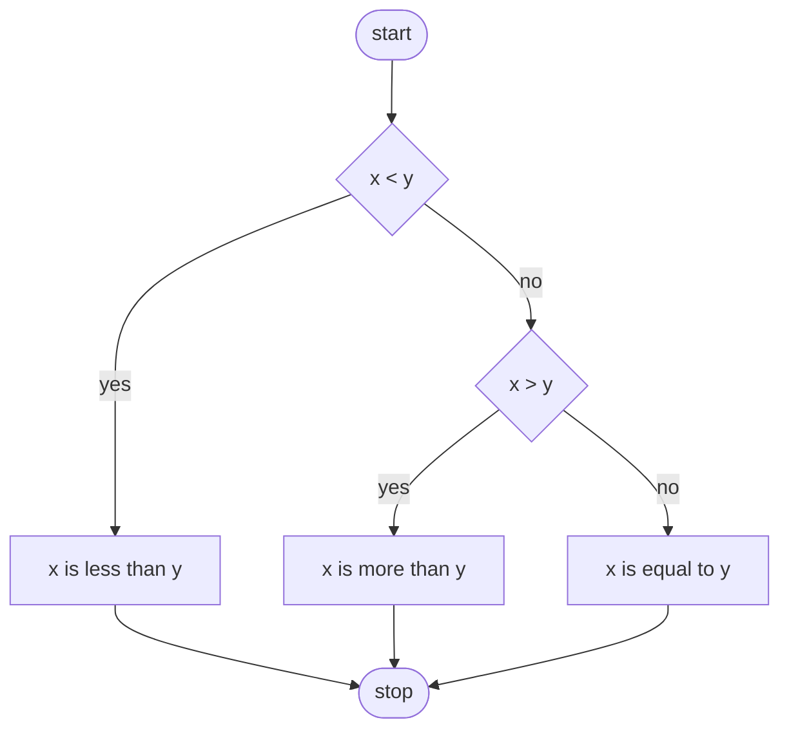

# Módulo de linguagem C 

1. É importante entendermos como é o processo de execução de um script em uma linguagem:

## Finalidade do comando `\n` em printf e mais outros comandos

Ele serve principalmente para quando for executado por uma CLI, a linha de comando não fique a frente do output, e existem diversos tipos de comandos como:
1. `\n` = move a linha de comando para uma nova linha
2. `\r` = move a linha de comando para totalmente a esquerda
3. `\"` = mostra no output aspas duplas "
4. `\\` = mostra como output contra barra \

## Finalidade do comando `#include <stdio.h>`, uma biblioteca C

- Esse comando comando está chamando uma biblioteca em C, que ao chamar a biblioteca podemos utilizar mais comandos que possuem suas definiçoes propias.

- Algumas linguagens como Python possuem comando simples como print já antecipadamente carregadas ao fazer ao realizar a execução e compilação do script, porém o C é necessario definir quais bibliotecas deverão ser utilizadas ao realizar a compilação e execução de um script

## Por que meu programa não compila?

No curso de Harvard é usado uma Makefile para compilar os arquivos em C sem precisar da definição de um comando extenso para cada vez que for necessario recompilar um script.

Primeiro você precisa configurar esse Makefile para seu uso, se você irá baixar a biblioteca e colocar em seu programa de compilação ou diretamente na pasta do projeto.

## Placeholder em cima de um printf

Para você fazer um print de uma variavel você tem que colocar um placeholder, e logo depois chamar a variavel para dentro dessa função.

`%s` = placeholder de uma string

## Comandos em linux

1. `cd` = change directory
2. `cp` = copy paste
3. `ls` = list directory
4. `mkdir` = make directory
5. `mv` = move
6. `rmdir` = remove directory

## Condicionais
`
if (x < y)
{
  printf("x is less tan y\n")
} else if (y < x) 
{
  printf ("y is less thab x\n)
} else {
  printf("y is equal to x")
}
`
- script de condição para verificar se um número é maior, menor ou igual a outro.

## Operadores

1. `=` = atribuição de valor
2. `<` = menor que
3. `<=` = menor ou igual que
4. `>` = maior que
5. `>=` = maior ou igual que
6. `==` = igual a
7. `!=` = diferente de

## Tipos de dados 

1. bool = verdadeiro ou falor
2. char = caracteres individuais
3. double = númeors decimais que armazenam até no maximo de **64 bits ou 8 bytes**
4. float = números decimais que armazenam até no maximo de **32 bits ou 4 bytes**
5. int = números inteiros que armazenam até maximo **32 bits ou 4 bytes**
6. long = números inteiro que armazenam até no maximo de **64 bits ou 8 bytes**
7. string = armazena caracteres 

# Funções da biblioteca cs50

1. get_char
2. get_double
3. get_int
4. get_long
5. get_string

# Types para mostrar output tipos de valores

1. %c = printa um caractere
2. %f = printa um float
3. %i = printa um int
4. %li = printa um long ou long int
5. %s = printa uma string

# variaveis

1. como definir?
`tipos de dado` `nome da variavel` = `valor dessa variavel`

2. como incrementar uma variavel como se fosse pontuação?
`counter = counter + 1;` ou
`counter += 1;` ou
`counter++;`

## Exemplos de design ruins em condições