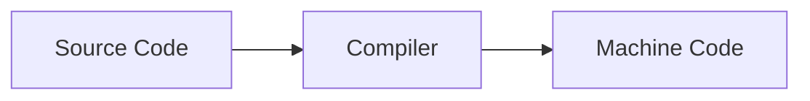

# Módulo de linguagem C 

1. É importante entendermos como é o processo de execução de um script em uma linguagem:

## Finalidade do comando `\n` em printf e mais outros comandos

Ele serve principalmente para quando for executado por uma CLI, a linha de comando não fique a frente do output, e existem diversos tipos de comandos como:
1. `\n` = move a linha de comando para uma nova linha
2. `\r` = move a linha de comando para totalmente a esquerda
3. `\"` = mostra no output aspas duplas "
4. `\\` = mostra como output contra barra \

## Finalidade do comando `#include <stdio.h>`, uma biblioteca C

- Esse comando comando está chamando uma biblioteca em C, que ao chamar a biblioteca podemos utilizar mais comandos que possuem suas definiçoes propias.

- Algumas linguagens como Python possuem comando simples como print já antecipadamente carregadas ao fazer ao realizar a execução e compilação do script, porém o C é necessario definir quais bibliotecas deverão ser utilizadas ao realizar a compilação e execução de um script

# Por que meu programa não compila?

No curso de Harvard é usado uma Makefile para compilar os arquivos em C sem precisar da definição de um comando extenso para cada vez que for necessario recompilar um script.

Primeiro você precisa configurar esse Makefile para seu uso, se você irá baixar a biblioteca e colocar em seu programa de compilação ou diretamente na pasta do projeto.

# Placeholder em cima de um printf

`%s` = placeholder de uma string